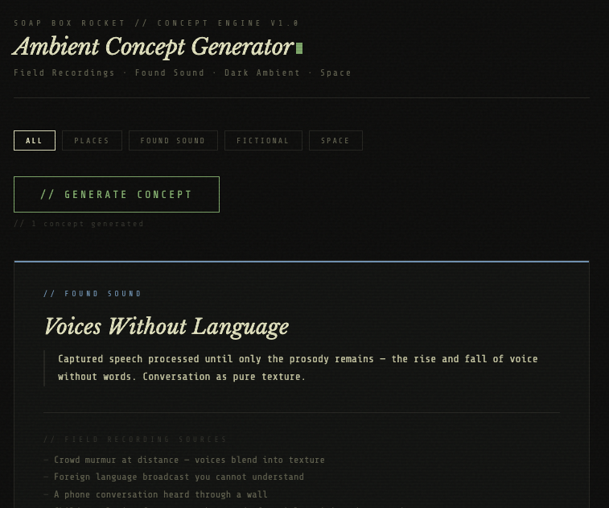

# Ambient Concept Generator

A browser-based inspiration tool for ambient musicians working with field recordings and found sound. Generates concepts with a core anchor, specific field recording sources, and a three-stage mood arc.

**[→ Open the Tool](https://craigdamlo.github.io/Ambient-Concept-Generator/)**



---

## What It Does

Each generated concept gives you three things:

- **A core anchor** — a specific place, found sound, fictional scenario, or space-related idea to build a piece around
- **Field recording sources** — concrete suggestions for what to capture or find, not abstract mood words
- **A mood arc** — a three-stage emotional progression to give the piece shape over time

Concepts are organized into four categories:

- **Places** — specific locations and the sounds that define them
- **Found Sound** — broadcasts, signals, recordings with inherent identity
- **Fictional** — scenarios and characters that imply a sonic world
- **Space** — astronomical events and phenomena, some using real NASA data

Filter by category or generate across all of them. The tool keeps a history so you can go back to earlier ideas.

---

## Running Locally

No build step, no dependencies, no install required.

```
git clone https://github.com/CraigDamlo/Ambient-Concept-Generator.git
cd Ambient-Concept-Generator
open index.html
```

Or just download the HTML file and open it in any modern browser. Works offline after the fonts load.

---

## Background

Made by [Soap Box Rocket](https://soapboxrocket.bandcamp.com) — a Seattle-based ambient project working primarily on the Dirtywave M8 and Deluge. The tool came out of wanting a creative partner that generates *specific, grounded* concepts rather than vague mood prompts.

The approach is inspired by tracks like [Number Station](https://soapboxrocket.bandcamp.com/track/number-station) — built around a captured shortwave number station broadcast — and [Maui Tuesday](https://soapboxrocket.bandcamp.com/track/maui-tuesday), recorded while sitting on a beach trying to match a synth engine to the real sound in front of me. The best pieces start with a real-world anchor. This tool helps find them.
